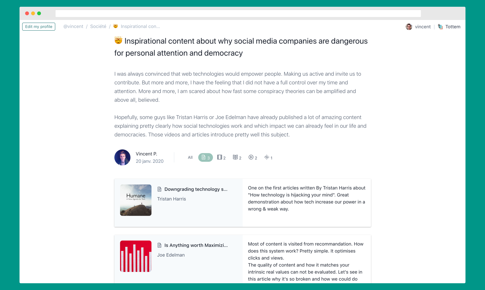

Tottem is an open source experimentation, it aims combining personal productivity tool approach with (slow) social media capabilities to make users empowered and somehow emancipated.

<div align="center">

[](https://beta.tottem.app)

### Library management made social

</div>

I have two considerations in mind:

-   building a product based on ethic design
-   experimenting open-source web technologies and share it

## Product

First goal: designing a product human centered allowing people to build and manage their online and public library. Just a tool to manage and gather the content we love, in order to share it with friends & community 😇

### Why ?

More and more, people — especially journalists, are loosing their ability to choose which content to promote & amplify. Consequently, what they will consume. Instead, automatic recommendation algorithms carefully choose the _best_ (sic!) content for you. Those deep learning algorithms create a unique & personnal narrative stream of content in your social feed... You said, _best_ ? So what ? Not really, it's just designed to maximize clicks and views. Of course, what else they can do?

[Here, I'm happy to share some references](https://beta.tottem.app/vincent/c/inspirational-content-about-why-social-media-companies-are-dangerous-for-personal-attention-and-democracy-ck5i4lwp2000vws9e4ry25feh)

So, what if I want to explore durable book or article recommendations from a friend? What if I want to really dig into a specific subject?

### How ?

Tottem aims combining personal productivity tool approach with (slow) social media capabilities to make users empowered and somehow emancipated.

Tottem aims to provide the same high quality user experience that most of modern productivity tools provide. Managing your library should be easy and enjoyable. With a great tool, great content could be made and shared.

The basic workflow:

1. Collect everything in one Inbox.
2. Organise into Spaces and Collection.
3. Express yourself and explain your opinion
4. Publish and share with your community

<div>

[](https://beta.tottem.app)

</div>

[](https://beta.tottem.app)

## Tech

The second goal is about experimenting how to build a web software today. This documentation explains which technologies are used here and how they are organised.

### Codebase

#### Technologies

It's a full-stack Typescript app with some code generation in order to have a type safe experience from end-to-end.

Here is a list of main technologies used:

-   🚀 React
-   🥇 NextJS to provide fast SSR experience
-   😍 TailwindCSS
-   📱 GraphQL, powered by Apollo tools
-   👮‍♂️ Auth0 for authentication
-   🚓 Prisma Framework to manage data model and database

**How is it typesafe end-to-end?**

**Prisma** provides a [library](https://github.com/prisma/photonjs) Photon that _generate_ a typesafe client to manipulate data depending on a unique schema declaration in `schema.prisma` file.

Example where Photon is used to retrieve the not softly deleted items from specific collection :

```
const items = (
    await ctx.photon.items.findMany({
        where: {
            collection: { id: collectionId },
            isDeleted: false,
        },
        select: { id: true, position: true },
        orderBy: { createdAt: 'desc' },
    })
```

**Nexus** provides a code-first graphql approach that allows you to _generate_ graphql schema (`schema.graphql` file) based on your resolvers and object definitions. Nexus is fully compliant with prisma and offers a nice [plugin](https://github.com/prisma-labs/nexus-prisma) to automatically declare resolvers based on your photon client.

**graphql-codegen** [tool](https://graphql-code-generator.com/) is configured to parse all `.gql` front-end files containing graphl queries and mutations. **graphql-codegen** uses remote and local (`localSchema.gql`) graphql schemas to generate every type and hook we need (putting them inside `types.ts`) so we can safely fetch and mutate data.

> Note that when global state management is required, Apollo Client is used as much as possible.

Example where typesafe hook `useGetItemsQuery` is generated allowing to fetch data via Apollo Client smoothly

```
const { data } = useGetItemsQuery({
        variables: {
            collectionId,
        },
    })
```

#### Repository structure — front-end

Inspired by those [recommendations](https://medium.com/@alexmngn/how-to-better-organize-your-react-applications-2fd3ea1920f1), this is how the codebase is structured:

```sh
tottem/
├── src
├──── generated # contains generated code (types, hooks, ...)
├──── pages # static and dynamic routes declaration used by NextJS
├──── components # shared generic component
├──── scenes # different parts of the application
├────── moduleName # Auth | Profile | Me ...
├──────── components # module components. **Each** components can specify its own specific components, queries, ...
├──────── queries.gql # All data queries and mutation are written in gql files
├──────── hooks.ts # Most of the reusable logic is written in hooks
├──────── index.tsx # Main scene file
├──────── View.tsx # Sometime stateless component are isolated in View file for clarity or reusability
└──── services # shared services as authentication, error management, ...
```

#### Setup

Locally PG instance is needed with some var env set. In `.env` for instance

```sh
AUTH0_LOCAL_ID='auth0|5dc8800986c8ba0e74d73654' # set local user id by passing auth0
AUTH0_CALLBACK='http://localhost:3000/auth/callback'
DATABASE_URL="postgresql://XXX@localhost:5432/XXX?sslaccept=accept_invalid_certs"
GRAPHQL_URL='http://localhost:4000/graphql'
DATABASE_PROVIDER="postgresql"
```

Then, two repositories are needed

```sh
git clone git@github.com:poulainv/tottem.git
cd tottem
npm install
npm run dev
```

```sh
git clone git@github.com:poulainv/tottem-graphql.git
cd tottem-graphql
npm install
npm run dev
```

Web app is avalaible on `http://localhost:3000` and graphql endpoint on `http://localhost:4000/graphql`

### Contributors

-   Clément Déon [@deonclem](https://github.com/deonclem)
